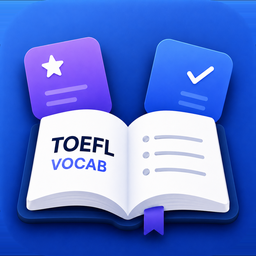
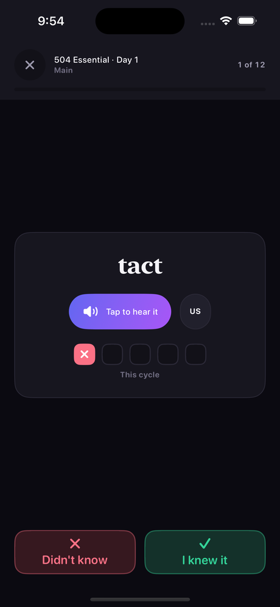
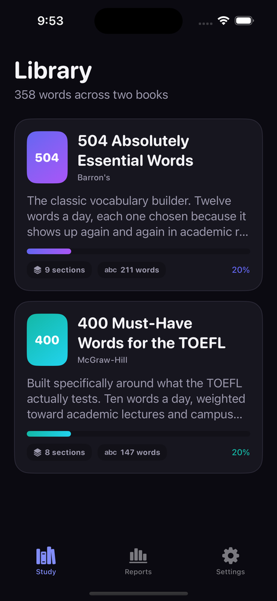
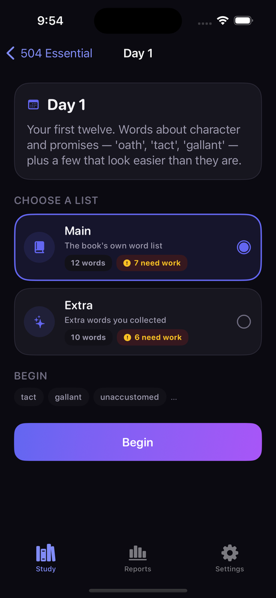
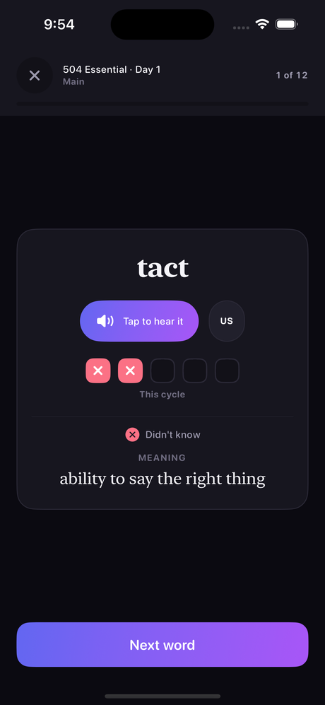
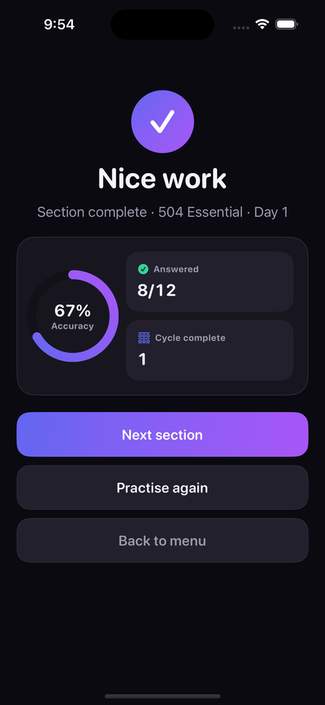
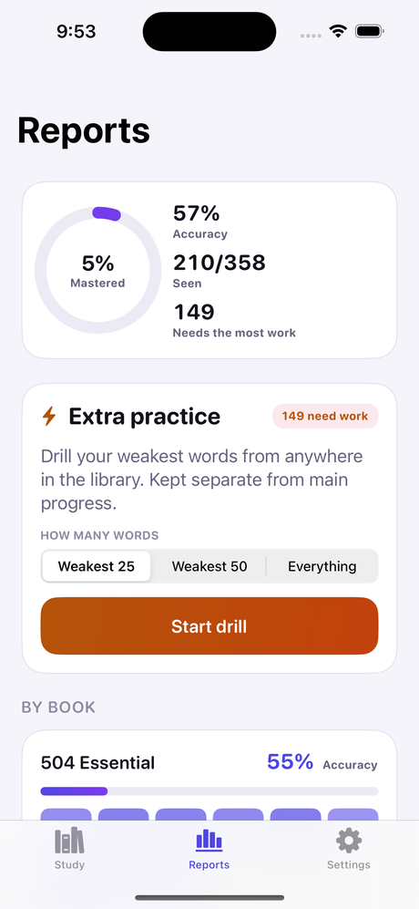
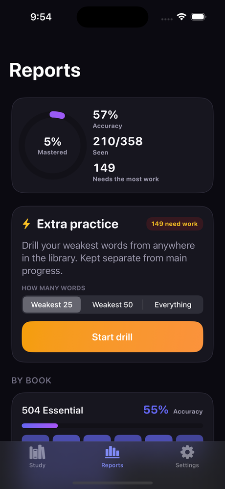

<div align="center">

# TOEFL Vocab



### Offline iOS vocabulary trainer built entirely on Windows — no Mac, no Xcode GUI, no paid Apple account, no local Simulator

[](https://swift.org/)
[](https://developer.apple.com/xcode/swiftui/)
[](https://github.com/yonaskolb/XcodeGen)
[](https://developer.apple.com/documentation/avfoundation)
[](.github/workflows/smoke-test.yml)
[](https://www.apple.com/ios/)
[](https://github.com/a1mohamad/toefl-vocabs-ios-app/actions)


**Research and Data**

[](Resources/VocabData/vocabs.json)
[](docs/PROJECT_PLAN.md)
[](https://a1mohamad.github.io/research/toefl-vocabs-ios-app/index.html)

**Contact and Profiles**

[](mailto:a1mohamad.askari@gmail.com)
[](mailto:amirmohmdaskari@icloud.com)
[](tel:+989012223122)
[](https://a1mohamad.github.io)
[](https://github.com/a1mohamad)
[](https://www.linkedin.com/in/amirmohammad-askari/)
[](https://www.kaggle.com/amirmohamadaskari)

<br>



</div>

**TOEFL Vocab** is an offline vocabulary trainer built on two classic word
lists — **504 Absolutely Essential Words** (Barron's) and **400 Must-Have Words
for the TOEFL** (McGraw-Hill). No account, no server, no subscription: the
content ships inside the app and progress is a single file on the device.

The unusual part is how it is built. Every commit is compiled, tested and
screenshotted by **GitHub Actions' free macOS runners**, because the developer
has no Mac. The `.xcodeproj` is never written by hand — it is generated fresh
on every run by **XcodeGen** from `project.yml` and is not committed at all.

---

## Table of Contents

- [Screenshots](#screenshots)
- [How It Works](#how-it-works)
- [Why This Project Is Interesting](#why-this-project-is-interesting)
- [Features](#features)
- [Content Model](#content-model)
- [Architecture](#architecture)
- [Application Modules](#application-modules)
- [Repository Structure](#repository-structure)
- [The No-Local-Build Workflow](#the-no-local-build-workflow)
- [CI/CD Pipeline](#cicd-pipeline)
- [Testing](#testing)
- [Adding Vocabulary](#adding-vocabulary)
- [Releasing to a Device](#releasing-to-a-device)
- [Current Scope and Limitations](#current-scope-and-limitations)
- [License](#license)

---

## Screenshots

Every screen below is captured automatically by CI on each push — see
[CI/CD Pipeline](#cicd-pipeline).

| Library | Section |
|:---:|:---:|
|  |  |
| Both books, with progress at a glance | Main / Extra picker, with the adaptive queue previewed |

| Meaning Revealed | Section Complete |
|:---:|:---:|
|  |  |
| Self-grade, then the definition appears | Accuracy, cycles completed, and where to go next |

### Light and Dark

Both appearances are first-class and verified on every CI run:

| Light | Dark |
|:---:|:---:|
|  |  |

---

## How It Works

Pick a book, pick a day, pick the **Main** or **Extra** list. Words come up one
at a time: hear it, decide whether you knew it, then the meaning is revealed.
Five boxes under each word track your last five answers — when the fifth lands
the row banks and resets for the next cycle.

Open a section again and the words you have been getting **wrong come first**.
A section you have never touched plays in book order.

**Reports** rolls everything up and launches an **Extra Practice** drill across
the whole library, ranked by what you are worst at. The drill keeps its own
counters and never moves your main progress.

---

## Why This Project Is Interesting

The build constraints shaped almost every technical decision in the repository:

- **No Mac, ever.** Development happens entirely on Windows. The only place
  Swift is ever compiled is a GitHub Actions macOS runner.
- **No Xcode GUI, no local Simulator.** No Interface Builder, no SwiftUI
  Previews. A change is only verified once it reaches CI.
- **No Apple Developer Program.** Signing uses a free personal Apple ID, so
  nothing can depend on paid-tier entitlements — no push notifications, no
  iCloud, no App Groups, no Sign in with Apple.
- **The repository must stay public.** That is what keeps GitHub Actions' macOS
  runner minutes unlimited and free.
- **The `.xcodeproj` is disposable.** Generated fresh by XcodeGen from
  `project.yml` on every run, and excluded from version control entirely.

Because there is no local Simulator, the unit tests and the content validator
carry more weight than they would in a normal iOS project — they are the only
fast feedback that exists before a full CI round trip.

---

## Features

### Study Flow

- Separate books, with an introduction before each book and each section.
- Words presented one at a time, in adaptive order.
- Two-choice self-grading (**I knew it** / **Didn't know**), with the meaning
  revealed immediately after.
- A five-box checklist per word tracks recent accuracy; a completed cycle stays
  visible as a "last 5" recap before resetting.
- Section-complete screen offers **Next section**, **Practise again**, or
  **Back to menu**.

### Adaptive Ordering

- Reopening a section always surfaces the most-missed words first.
- Deterministic and score-based — Laplace-smoothed error rate, recency bonus,
  mastery decay — so the same history always produces the same queue.
- An untouched section plays in book order.

### Extra Practice

- A separate drill, launched from Reports, spanning the whole library.
- Ranked by main-mode weakness, so it targets what study has shown is weak.
- Keeps independent right/wrong counters — never affects main progress.
- Scope selector: weakest 25, weakest 50, or everything.

### Reports

- Mastery ring, accuracy, and a per-book **section heat grid** rather than a
  long list of rows.
- Recent-session accuracy trend.
- Main vs. Extra split and run number.

### Pronunciation

- `AVSpeechSynthesizer` with selectable US / UK / AU accents and an adjustable
  speech rate — fully on-device, no bundled audio files, no network access.

### Accessibility and Localization

- Dynamic Type throughout; no fixed point sizes in body text.
- VoiceOver labels combine multi-part controls into single readable elements.
- English and Persian, with automatic right-to-left layout for Persian.

---

## Content Model

All vocabulary lives in `Resources/VocabData/vocabs.json`, bundled into the app
— nothing is fetched from a server. The file is keyed book → section → category,
and word order is stored explicitly as an array, because a JSON *object* has no
guaranteed key order:

```json
{
  "504": {
    "day_1": {
      "main": [
        { "term": "abandon", "definition": "desert; leave without planning to come back" }
      ],
      "extras": [
        { "term": "disobey", "definition": "fail to obey" }
      ]
    }
  }
}
```

Each section carries two lists: **main**, the book's own words, and **extras**,
additional words collected alongside them. Either may be absent — a review
section with no extras simply does not offer that list.

A second file, `Resources/VocabData/catalog.json`, supplies **book and section
order**, titles and intro copy — the same ordering problem one level up. Without
it, no sort function would know that a review section belongs between two
numbered days rather than after all of them. A section missing from the catalog
still works: it is appended at the end with a generated title rather than hidden.

The app reads whatever is present at launch. Adding vocabulary is a data change
with no code change — see [Adding Vocabulary](#adding-vocabulary).

---

## Architecture

MVVM, with a `Router` standing in for a coordinator:

```text
Sources/TOEFLVocab/
    App/             entry point, dependency wiring, root tab view
    Navigation/      Router, Route, PracticeConfiguration
    Core/
        Models/        content and progress data types
        Content/       VocabCatalogLoader
        Persistence/   ProgressStore, SettingsStore
        Engine/        AdaptiveOrdering, StatsAggregator
        Audio/         PronunciationService, Haptics
        Localization/  Strings
    DesignSystem/    palette, typography, shared components
    Features/        Library, Book, Section, Practice, Reports, Settings
```

Five observable stores are injected once at the root — `ContentProvider`,
`ProgressStore`, `SettingsStore`, `PronunciationService`, `Router`. Only the
practice screen has a dedicated view model; everything else is a pure function
of the stores, recomputed on render.

Progress persists as a single `Codable` file rather than SwiftData: SwiftData
requires iOS 17, and with no local Simulator a schema bug would cost a full CI
round trip just to observe.

---

## Application Modules

| Module | Responsibility |
|---|---|
| `Core/Content/VocabCatalogLoader.swift` | Merges `vocabs.json` and `catalog.json` into an ordered, indexed catalog |
| `Core/Engine/AdaptiveOrdering.swift` | Scores and orders words by weakness; drives both study and the drill |
| `Core/Engine/StatsAggregator.swift` | Rolls per-word history up into the Reports screen |
| `Core/Persistence/ProgressStore.swift` | Atomic, debounced persistence of all practice history |
| `Core/Audio/PronunciationService.swift` | `AVSpeechSynthesizer` wrapper with accent and rate control |
| `Core/Localization/Strings.swift` | String table with English/Persian resolution and RTL support |
| `Features/Practice/PracticeViewModel.swift` | The practice session state machine |
| `Features/Reports/ReportsView.swift` | Mastery ring, section heat grid, weakest-words list, drill launcher |
| `Navigation/Router.swift` | Tab and stack navigation, modal practice sessions |

---

## Repository Structure

```text
toefl-vocabs-ios-app/
|-- project.yml                     XcodeGen input -- the only project definition
|-- Resources/
|   |-- VocabData/
|   |   |-- vocabs.json             all words, grouped book -> section -> category
|   |   +-- catalog.json            book/section order, titles, intro copy
|   +-- Assets.xcassets/            app icon
|-- assets/                         README screenshots and icon
|-- Scripts/                        content validator, migrator, icon builder (run on Windows)
|-- Sources/TOEFLVocab/             application source (see Architecture)
|-- Tests/TOEFLVocabTests/          engine, loader and localisation tests
|-- docs/PROJECT_PLAN.md            full design notes and algorithm rationale
+-- .github/workflows/smoke-test.yml
```

---

## The No-Local-Build Workflow

There is no `xcodebuild` on this machine, so the local loop is content
validation rather than compilation:

```bash
python Scripts/validate_content.py
```

Checks both JSON files, catches duplicate terms, empty definitions, stray
whitespace and catalog/data mismatches, and prints a word-count table. Runs in
about a second. Run it before every push.

```bash
python Scripts/migrate_vocabs.py
```

Converts legacy `{term: definition}` blocks into the ordered-array form. Run it
after pasting new content in the old style.

```bash
python Scripts/make_app_icon.py path/to/artwork.png
```

Rebuilds the app icon asset. Squares off rounded or transparent corners — iOS
applies its own mask and rejects an alpha channel — then resizes to 1024x1024.
Requires `pip install Pillow`.

Everything else — compiling, running the tests, rendering the UI — happens only
once code reaches GitHub Actions.

---

## CI/CD Pipeline

`.github/workflows/smoke-test.yml` runs four jobs:

```text
push / pull_request
        |
        v
content-lint          (ubuntu, ~15s -- gates everything below)
        |
        +----------------------------+
        |                            |
        v                            v
unit-tests                  simulator-check
(macOS, xcodebuild test)    (macOS, build + verify bundle + screenshot)
                                      |
                                      v
                             every screen x light/dark

tag matching v*
        |
        v
device-build           (macOS, Release, CODE_SIGNING_ALLOWED=NO)
        |
        v
unsigned .ipa artifact  -> downloaded, signed and installed with Sideloadly
```

| Job | Runs on | Trigger | Purpose |
|---|---|---|---|
| `content-lint` | ubuntu | every push/PR | `validate_content.py --strict`; gates the macOS jobs so a bad JSON edit never costs a runner minute |
| `unit-tests` | macOS | every push/PR | `xcodebuild test` — the only fast feedback on the practice engine |
| `simulator-check` | macOS | every push/PR | Builds, verifies the bundled JSON and compiled icon are actually inside the `.app`, then screenshots every screen in light and dark |
| `device-build` | macOS | tags matching `v*` | Release build, `CODE_SIGNING_ALLOWED=NO`, packaged as an unsigned `.ipa` artifact |

The screenshots in this README come straight out of `simulator-check`. A
`DEBUG`-only harness launches the app once per screen with a
`screenshot:<name>` argument, seeds deterministic progress so Reports and the
checklists are never captured empty, and opens directly to that page — no UI
automation to go stale.

The bundle-verification step exists because a dropped resource entry in
`project.yml` produces an app that builds, launches and screenshots fine while
being completely empty — a failure mode that would otherwise look like a UI bug
and cost a full round trip to diagnose.

---

## Testing

With no local Simulator, the unit tests are the only verification available
before a CI round trip, so they target the logic that a screenshot cannot show:

| File | Covers |
|---|---|
| `WordStatsCycleTests.swift` | The five-answer cycle rule, recap display, and persistence resilience against a hand-edited or truncated save file |
| `AdaptiveOrderingTests.swift` | The weakness-scoring formula, ordering determinism, and the Extra Practice queue |
| `VocabCatalogLoaderTests.swift` | Book/section ordering against `catalog.json`, legacy word-format fallback, and graceful degradation on missing content |
| `ReportingAndStringsTests.swift` | Stats aggregation, run-completion logic, and bilingual string-table coverage |

```bash
xcodebuild test -project TOEFLVocab.xcodeproj -scheme TOEFLVocab \
  -destination "id=<simulator-udid>"
```

Runnable only inside CI or on a real Mac — there is no local target for it here.

---

## Adding Vocabulary

1. Append to `Resources/VocabData/vocabs.json`:

   ```json
   "day_9": {
     "main": [
       { "term": "ubiquitous", "definition": "found everywhere" }
     ]
   }
   ```

2. Add one line to `Resources/VocabData/catalog.json` for the title and intro.
   Skipping this still works — the section is appended last with a generated
   title.
3. Run the validator, then commit. No Swift changes needed.

---

## Releasing to a Device

Regular pushes only run the free Simulator check. A real installable build needs
a version tag:

```bash
git tag v1.2
git push origin v1.2
```

Download the unsigned `.ipa` artifact from the workflow run, then sign and
install it with **Sideloadly** using a free Apple ID.

> Known free-tier limits, not bugs: installed apps expire after about 7 days and
> need periodic re-signing, and a free account can only register a small number
> of App IDs per rolling 7-day window.

---

## Current Scope and Limitations

Current scope:

- Offline, single-device vocabulary practice
- Bundled word lists, English content, English/Persian UI
- Sideloaded distribution via Sideloadly, not the App Store

Current limitations:

- No push notifications, iCloud sync or App Groups — the free Apple ID tier
  cannot use them
- No local build or Simulator; every change is verified through CI
- Installed builds expire roughly weekly and require re-signing
- Progress does not sync across devices

The natural upgrade path — App Store distribution, iCloud progress sync, push
reminders — all require the paid Apple Developer Program, which this project
deliberately does not use.

---

## License

Released under the MIT License.
